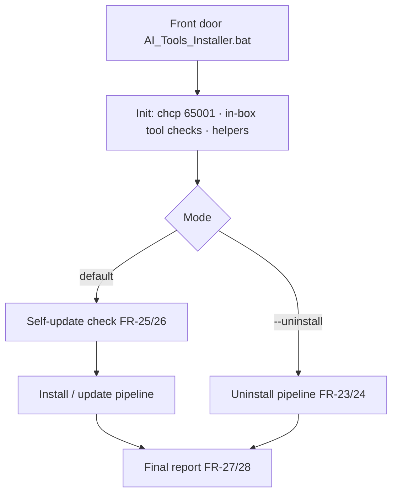
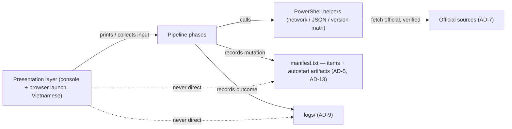

# Architecture Spine — AI Tools Installer

## Design Paradigm

**Phased pipeline with a mode router, over a presentation boundary.** The product is one `.bat` file whose front door reads the invocation and dispatches to exactly one pipeline: **install/update** (default), **uninstall**, or **self-update**. The install pipeline is a fixed linear sequence of phases — *welcome → scan → plan+confirm → execute → configure → report* — and each phase is composed of **idempotent steps**. Everything a step needs to show the user goes through the **presentation layer**, the only code that prints to console. Everything the machine does is recorded by the step into **run state**, `manifest.txt` (the durable mutation record), and `logs/`.

The presentation boundary is the load-bearing shape: two independent builders — one on the wizard epics, one on the install/uninstall epics — cannot agree on how console output works unless this is fixed here. A second interaction channel exists: launching the 9Router dashboard and OpenClaw UI in the user's browser (FR-21/22). It is also presentation, not a free-acting step.

**Runtime split (binding):** `cmd.exe` batch orchestrates the pipeline, the router, and the console UI; PowerShell (invoked inline, 5.1 in-box) owns *all* network fetches, JSON parsing, and version math. `[ADOPTED — user confirmed 2026-08-15; addendum §1]`



## Invariants & Rules

### AD-1 — Phased pipeline with a mode router

- **Binds:** whole spine; every phase and step
- **Prevents:** install, uninstall, and self-update flows interleaving; phase ordering drifting between independently-built steps; no single owner of "what happens in what order"
- **Rule:** the front door dispatches to exactly one pipeline by mode. The install pipeline phase order is fixed: welcome → scan → plan+confirm → execute → configure → report. No step may run outside its pipeline, and no pipeline may reorder phases. **Failure policy:** a failed step is recorded and reported; the pipeline continues with the remaining steps; a re-run retries only the outstanding work (see AD-12). **Execute order** is topological: Node before the npm-installed items (OpenClaw, 9Router), VSCode before the Claude Code extension (FR-15/16). The user may stop/cancel at any step; cancellation is safe because every step is idempotent and nothing commits until the plan is confirmed (FR-2, FR-3).

### AD-2 — Hybrid runtime: batch orchestrates, PowerShell computes

- **Binds:** all steps that touch the network, parse JSON, or compare versions
- **Prevents:** version-math attempted in pure batch (addendum §1: "không thực hiện so sánh phiên bản ngay trong batch thuần"); an all-PowerShell design that loses the simple cmd control flow and in-box tooling
- **Rule:** batch owns sequencing, conditionals, console interaction, and exit-code chaining. Any network call, JSON parse, or version comparison is delegated to an inline PowerShell block. A step must not implement either half inside the other.

### AD-3 — Single-file rule

- **Binds:** the shipped artifact; distribution
- **Prevents:** the "one file, run it" promise being broken by sidecar scripts (helpers.ps1, version-utils.bat); fragmented artifact ownership
- **Rule:** the deliverable is exactly one self-contained `.bat`. All helper code, PowerShell blocks, UI, manifest handling, and update logic are inlined. No additional shipped files at any altitude. (The tool *installs* other programs; that is unrelated.)

### AD-4 — No-admin, per-user gate

- **Binds:** every mutation any step performs on the machine (FR-10–16); platform is Windows 10/11 **64-bit** (all seven installs are `-x64`)
- **Prevents:** the Git installer silently elevating on admin accounts (addendum §2 Git — full installer elevates when the account is admin); installs that write `%ProgramFiles%`/HKLM; any UAC prompt appearing
- **Rule:** all writes confined to `%LOCALAPPDATA%`, `HKCU`, and the **user** PATH. Zero HKLM/`%ProgramFiles%` writes, zero UAC prompts across any session (SM-2). Git installs via MinGit; Node via ZIP (or `msiexec /a` payload extract); Python with `Include_launcher=0`; VSCode User Setup. A step that would need admin **must not** be implemented — it is a failure to route around, not to elevate.

### AD-5 — Manifest is the source of truth for uninstall

- **Binds:** uninstall pipeline; install/configure steps that mutate the machine; the manifest itself
- **Prevents:** uninstall overreach — touching apps the user installed themselves; destructive guessing about "what the tool installed"; a manifest schema two builders read differently
- **Rule:** every machine mutation by install/configure steps is recorded in `%LOCALAPPDATA%\AITools\manifest.txt`. **Schema is exactly four fields, one per line:** `item | version | installed-at-YYYY-MM-DD | path` (version is the AD-6-normalized string, path is the per-user install/removal target). Uninstall removes only what the manifest records — items, and the autostart artifacts AD-13 records — and wipes the manifest and `logs/` when done (FR-23/24, addendum §7). Anything not in the manifest is never removed.

### AD-6 — Per-item decision model

- **Binds:** scan & decide phase (FR-5–8); every stack item; the version-check helper
- **Prevents:** ambiguous "installed?" verdicts; downgrades; a step misreading another step's version format; scan-vs-install recording different version strings
- **Rule:** for each of the 7 items, the version-check returns exactly one of `INSTALL | SKIP | UPDATE` plus a **normalized** version string. A **single shared version-check helper is the only producer of version strings** — manifest, log, and plan all record exactly its output. Normalization per addendum §1 map: Node strip leading `v`; Python/9Router clean semver; VSCode take line 1 of `code --version`; OpenClaw take token 2 (`2026.7.1-2`, calendar — compare as string, not semver); Git take the `X.Y.Z.windows.P` tail. Never downgrade (FR-7). Detect and exclude the Python Store-stub (`WindowsApps`) and portable-node-of-OpenClaw from "installed" verdicts (FR-5).

### AD-7 — Official sources only, verified downloads

- **Binds:** all downloads; self-update (FR-9, FR-25, NFR-SEC-1, NFR-REL-1)
- **Prevents:** third-party mirrors; supply-chain drift; an "update" pulled from anywhere other than the tool's own repo; single-attempt downloads failing silently
- **Rule:** every download URL points at the item's official domain: git-for-windows GitHub releases, `nodejs.org`, `python.org`, `update.code.visualstudio.com`, `registry.npmjs.org`. The tool's own updates come only from `giakhanhquoc141-rgb/AI_AGENT_INSTALL` GitHub releases (FR-25); a `404`/empty release is treated as "no update". Downloads have **bounded retry (3 attempts)**; a failed/partial download is reported and must not corrupt other items (NFR-REL-1). Verify a downloaded installer against an official SHA256 where the source exposes a fetchable hash (per-source fetch mechanism is a build decision — see Deferred).

### AD-8 — Secrets never touch the tool; no telemetry

- **Binds:** every step; manifest; logs; self-update (FR-19, FR-27, NFR-SEC-2)
- **Prevents:** API keys leaking into artifacts the user hands to support, or into any network transmission; undeclared phone-home traffic
- **Rule:** the tool never reads, writes, stores, or transmits API keys. Keys are entered by the user in the 9Router dashboard during first-run config. Manifest and logs carry no key material, by construction (FR-19, NFR-SEC-2). The only network activity in any session is the **declared** official fetches (AD-7) and the self-update check — no telemetry, no undeclared outbound request.

### AD-9 — Step contract

- **Binds:** every pipeline step; UI; logging (FR-2, FR-28, NFR-REL-2, NFR-OBS-1)
- **Prevents:** one step showing raw error codes while another hides the failure; user-facing text inconsistent with the log
- **Rule:** every step exits `0` on success / nonzero on failure, appends exactly one log line (`step | ok|fail|skip | version | path | timestamp`) to `%LOCALAPPDATA%\AITools\logs\ai-tools-installer.log`, and on failure shows a **Vietnamese, non-technical** message (what happened + suggested next action). Raw codes go to the log only, never the console (NFR-REL-2). The same contract governs launching the browser for dashboard/onboarding: the step opens the fixed endpoint and presents Vietnamese guidance, never bare URLs or commands.

### AD-10 — PATH discipline, single controller

- **Binds:** every step that touches PATH (FR-11, FR-14, FR-17, FR-24)
- **Prevents:** `setx` truncating user PATH >1024 chars; a step failing because it reads the stale console PATH; multiple writers corrupting one user PATH
- **Rule:** user PATH is owned by **one PATH controller** that does read → append-if-absent → write, preserving the value type (`REG_EXPAND_SZ`, so `%USERPROFILE%`-based entries survive) via `reg add "HKCU\Environment"`. Never `setx`, never direct `set PATH=` persistence. Install steps **declare** their PATH entries (AD-4 targets); they never write PATH themselves. The controller refreshes PATH in-session after each PATH-mutating step before the next dependent step (FR-17), reading the user PATH back from the registry (`reg query HKCU\Environment /v Path`), not the captured console environment. Uninstall removes only the entries this tool added (AD-5, FR-24).

### AD-11 — UTF-8 + Vietnamese only

- **Binds:** every console interaction; all user-facing strings (FR-4, NFR-COMP-1)
- **Prevents:** mojibake on Win10/11; English jargon leaking to non-technical users
- **Rule:** the console runs `chcp 65001`; all user-facing strings are Vietnamese, free of technical jargon, with no English user-facing strings. Version formats and logs may contain ASCII/English tokens internally; the console presentation of them must be Vietnamese.

### AD-12 — Idempotency

- **Binds:** every step; re-runs (NFR-REL-1, FR-18, FR-20)
- **Prevents:** double `my-combo`; reinstall loops; duplicate autostart entries; an "update" re-downloading what is already current
- **Rule:** any re-run is safe: never reinstall over an existing install, never downgrade (AD-6), never create a second `my-combo` (FR-18), never duplicate an autostart registration (FR-20). Re-derivation is **across runs**: each run re-scans and re-decides (plan is not cached between runs). Within a run, the **run-state set is written once by the scan/decide phase and read-only afterwards** — execute and configure read it, they never rewrite it.

### AD-13 — Autostart artifacts are manifest-recorded and removal-driven

- **Binds:** configure phase (FR-20); uninstall pipeline (FR-24)
- **Prevents:** uninstall leaving OpenClaw/9Router autostart behind because configure created artifacts whose identity uninstall never knew (e.g. an `openclaw gateway install` scheduled task without an `AITools-` name)
- **Rule:** every autostart artifact the tool creates — 9Router Run-key or Startup-folder `.lnk`, and the OpenClaw gateway registration (official mechanism) — is recorded in the manifest by **kind + exact name + target** (addendum §3). Uninstall removes exactly the recorded set, preferring each item's official removal path (e.g. `openclaw gateway uninstall`) and removing recorded Run-key/`.lnk` entries. The *mechanism* (Run key vs `.lnk` vs scheduled task) is a per-item build decision; the *artifact identity being recorded and removed* is this invariant.

## Consistency Conventions

| Concern | Convention |
| --- | --- |
| Naming (entities, files, events) | Canonical item ids: `git, node, python, vscode, claude-code, openclaw, 9router`. Autostart entries prefixed `AITools-` (AD-13 also records non-prefixed official artifacts). Manifest lines `item\|version\|installed-at-YYYY-MM-DD\|path`. Log lines `step \| ok\|fail\|skip \| version \| path \| timestamp` |
| Data & formats (ids, dates, error shapes) | Version normalization per addendum §1 map, produced only by the shared version-check helper (AD-6); decision enum `INSTALL/SKIP/UPDATE`; dates `YYYY-MM-DD`; local paths always `%LOCALAPPDATA%`-anchored; dashboard ports fixed — 9Router `localhost:20128`, OpenClaw gateway `127.0.0.1:18789` |
| State & cross-cutting (mutation, errors, logging, config) | Run-state set written once by scan/decide, read-only after (AD-12); mutation recorded to manifest (AD-5/AD-13) + log (AD-9); no telemetry, no remote state (AD-8); errors = Vietnamese user message + full detail in log (AD-9) |

## Stack

*Tool's own runtime — all in-box on Win10 1803+/Win11, nothing to download to run the tool itself. In-box availability confirmed against Microsoft (curl/tar since build 17063 → 1803 GA) and the addendum.*

| Name | Version |
| --- | --- |
| cmd.exe (batch) | in-box, Win10 1803+ / Win11 (64-bit) |
| PowerShell | 5.1 (in-box) |
| curl.exe / tar.exe | in-box since build 17063 → 1803 GA |
| certutil.exe (SHA256) | in-box — release-time checksum distribution (PRD §6); runtime fetch mechanism deferred to build |
| reg.exe | in-box |

*Stack the tool installs (seed — owned by the version-check once built; per addendum §1 map, verified 2026-08-15):*

| Name | Version (verified 2026-08-15) |
| --- | --- |
| Node.js | LTS 22.x/24.x — **never** Current 26.x (FR-8, OpenClaw engine) |
| Python | 3.13.x (3.13.9; 3.14 full-installer status re-verify at build) |
| VS Code | User Setup, latest stable (1.133.0 at authoring) |
| Git | MinGit 2.55.0.4-64-bit |
| OpenClaw | npm `latest` (calendar version, e.g. 2026.7.1-2) |
| 9Router | npm `latest` (0.5.50 at authoring — moves daily) |
| Claude Code ext | `anthropic.claude-code` (marketplace-managed) |

## Structural Seed

**Single-file internal layout** — named blocks, fixed order. The code owns the detail; this is scaffold:

```text
AI_Tools_Installer.bat
  [init]        chcp 65001 · banner · in-box tool checks
  [helpers]     colored-print · log_append · version-check (PowerShell blocks) · PATH controller
  [router]      mode dispatch → install | uninstall | self-update
  [scan]        per-item version-check → DECISION per item (AD-6); writes run-state once (AD-12)
  [plan]        plan table · Y/N confirm (FR-3)
  [execute]     install-<item> one block per item, topological order (AD-1, AD-4, AD-7)
  [configure]   combo my-combo · autostart (records AD-13) · onboarding (AD-8, AD-12)
  [uninstall]   read manifest → remove recorded items + autostart artifacts (AD-5, AD-13)
  [self-update] release check (404 = none) + safe self-replace (AD-7, AD-12)
  [report]      final summary + log path (AD-9)
```

**Data flow** — who may depend on whom (a rule, per AD-1):



Dependency direction: **presentation → pipeline → helpers → (official sources | manifest | logs)**. Nothing but the presentation layer prints or launches the browser; nothing but pipeline steps mutates the machine or the manifest; helpers never print, never mutate — they return values.

**Environment / operational envelope:** there is **no deployed infrastructure** — the tool runs locally on the target machine, mutating only that machine. All external interaction is outbound HTTPS to official sources (AD-7) and the tool's own GitHub repo (self-update); no telemetry, no inbound services, no servers (AD-8). Distribution = GitHub release of the unsigned `.bat` + SHA256, accepting the SmartScreen warning with README guidance (PRD §6). Observability = local logs only (NFR-OBS-1). Performance target (soft): a fresh install completes in ~10–15 min (NFR-PERF-1, PRD A3).

## Capability → Architecture Map

| Capability / Area | Lives in | Governed by |
| --- | --- | --- |
| §4.1 Wizard & navigation (FR-1–4) | presentation layer + router + plan/report blocks | AD-1, AD-11, AD-9 |
| §4.2 Scan & version decision (FR-5–8) | `[scan]` block + version-check helper | AD-6, AD-2 |
| §4.3 Install (FR-9–17) | `[execute]` blocks, per item | AD-4, AD-7, AD-10, AD-12, AD-1 |
| §4.4 Combo `my-combo` (FR-18–19) | `[configure]` block | AD-8, AD-12 |
| §4.5 First-run config (FR-20–22) | `[configure]` block + browser launch | AD-12, AD-13, AD-9 |
| §4.6 Uninstall (FR-23–24) | uninstall pipeline | AD-5, AD-10, AD-13 |
| §4.7 Self-update (FR-25–26) | self-update router branch | AD-7, AD-12 |
| §4.8 Log & report (FR-27–28) | `[report]` + log helpers | AD-9 |
| NFRs — security/privacy (NFR-SEC-1/2) | every step | AD-7, AD-8 |
| NFRs — reliability (NFR-REL-1/2) | every step | AD-1, AD-6, AD-7, AD-9, AD-12 |

## Deferred

Decisions intentionally pushed down, each with why it can wait:

- **Node install mechanism — ZIP vs `msiexec /a`** (PRD OQ-3). Both satisfy AD-4 (no admin); per-item implementation detail. Revisit at build, verify the winner against `node --version` + `npm --version` from a fresh console (FR-11). Safe to defer because AD-5's `path` field records whichever target is chosen, so uninstall still works.
- **Git — MinGit vs full silent installer.** MinGit is the default (guarantees AD-4 on admin accounts); the full installer is an alternative only for accounts verified standard. Not an invariant — AD-4 is. Decide at build (addendum A9/OQ-6).
- **Per-source SHA256 fetch mechanism.** AD-7 binds verification where an official fetchable hash exists; *how* each source's hash is fetched is a build decision (addendum §8 covers SHA256 as a release artifact; runtime fetch to be confirmed per source).
- **npm `--allow-scripts` policy on npm 11.13–11.15.** Behavior verified for npm 12 (blocks by default → `--allow-scripts openclaw`) and ≤11.12; the 11.13–11.15 band needs build-time confirmation (addendum §2 OpenClaw).
- **Autostart *mechanism* per item** — 9Router Run key vs `.lnk`; OpenClaw scheduled-task vs startup-folder. The artifact-identity contract is AD-13; only the mechanism stays open (PRD A2).
- **Python 3.13 vs 3.14** — pinned 3.13.x for v1; re-verify the 3.14 installer story at build.
- **Console visual polish** (logo layout, colors `38;5;214` orange/white, spacing). A UX/build-level detail; the presentation boundary (AD-1) already confines it.
- **Log-collection UX for support** (PRD OQ-5): manual copy vs a generated zip. Decide while building the report block / wizard.
- **Support channel** (PRD OQ-1): assumed GitHub Issues + a "send log" issue template — a process decision, not architecture. Cut a v0.1 release before exercising FR-25/26 (repo has no release yet).
- **v2 scope** (PRD §9.2, out of v1): offline/portable, macOS, multi-language, background self-update of tools, fleet silent automation. Revisit after v1 ships.
